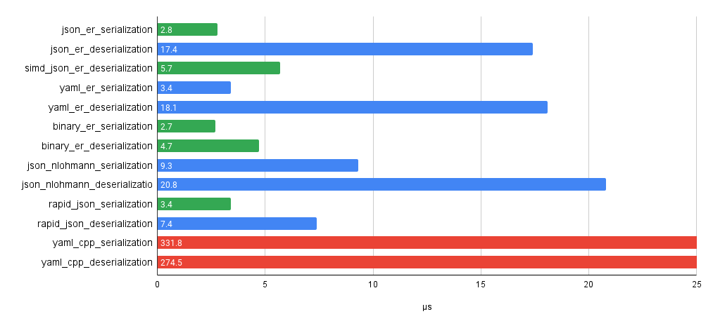
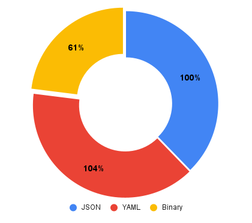

# Easy Reflection solution for C++

[](https://github.com/chocolacula/reflection_cpp/actions/workflows/cmake.yml)

It parses C++ sourcecode for special attributes. In the simplest situation you only need mark an object by ```ER_REFLECT()``` macro. All other work will be done by code generation tool and reflection library.

The main idea is use kinda dynamic typing and **Run Time Type Checking** for some type agnostic operations, like copying or taking name of a type.  
It makes possible determine a variable type and do right job - print, serialize/deserialize or whatever.

## Features

- Linux, MacOS and Windows(beta) support
- translate enums to string and vise versa
- support of stl containers like ```std::vector```, ```std::list```, ```std::map```, etc.
- native serialization directly to an object and without third parties for:
  - **JSON**
  - **YAML 1.2** even with anchors, but keep in mind that variables behind anchors have to have the same type.
  - binary with **Variable Length Quantity** to reduce number of bytes
- debug printing
- understandable errors

## Installation

At first you have to download and compile **Clang**. The generator as a part of this project uses Clang to analyse C++ source code.  
You can build Clang [from source](https://clang.llvm.org/get_started.html), install from [vcpkg](https://github.com/microsoft/vcpkg) or from repositories of your distro.  
Please pay attention to ```generator/CMakeLists.txt```, it's fit for LLVM and Clang libraries from **Ubuntu** or **Arch Linux** repos or built from source with options:

```
-DLLVM_ENABLE_PROJECTS=clang
-DLLVM_ENABLE_RTTI=ON
-DLLVM_LINK_LLVM_DYLIB=ON
-DCLANG_LINK_CLANG_DYLIB=ON
```

or without last two options for static linking. Set ```-DLINK_CLANG_STATIC=ON``` while building the generator in this case.

> **Note:** ```-DLLVM_LINK_LLVM_DYLIB=ON``` is not available on Windows if you compile Clang by MSVC, only static libraries.

On Windows, moreover, you should provide correct path to a build directory with LLVM's CMake config files in ```CMAKE_PREFIX_PATH```.

> **Note:** If you faced errors like ```stddef.h``` or ```stdarg.h``` not found, check include folders, perhaps you need few symlinks.  
It's quite old problem and easy to google. Do not ignore them, it would lead to analysis errors e.g. missed template parents of an analyzed class.

The next step is update all submodules

```shell
git submodule update --init --recursive
```

One of the submodules is [vcpkg](https://github.com/microsoft/vcpkg) which manages most of the dependencies, all of them will be installed by CMake automatically.

> **Note:** The project version is obtaining by ```python3``` from ```vcpkg.json``` manifest file.  
It will be installed at least as **gcc** dependency on Linux systems, otherwise please install it manually.

After you have installed all dependencies you should made a decision do you wanna use [simdjson](https://github.com/simdjson/simdjson) for parsing or don't.  
Native for the solution parser will be available anyway but it's slower though a bit more flexible in map parsing.  
If for some reason you wanna reduce number of dependencies you can exclude ```simdjson``` via CMake option:

```
-DUSE_SIMD_JSON=OFF
```

### Docker

The repository also provides a ```Dockerfile``` which initializes ```Ubuntu 20.04``` environment, copy project files, builds it and runs tests on startup.

## How to use

Lets assume you are developer of a company employees registry and have a class:

```cpp
class Employee {
 public:
  std::string name;
  std::string position;
  uint16_t room;
  std::vector<uint32_t> project_ids;

 private:
  uint8_t age;
  uint8_t total_experience;
}
```

To get data from **MongoDB** and map it to the class instance you only need to do few simple actions:

Include header with defined attributes and add ```ER_REFLECT()``` attribute before class declaration

```cpp
#include "er/attributes.h"

ER_REFLECT()
class Employee {
 public:
  std::string name;
...
```

in this case **private** fields will be omitted, to reflect them add:

```cpp
#include "er/attributes.h"

ER_REFLECT(WithNonPublic)
class Employee {
 public:
  std::string name;
...
```

But note they are fields for **reflection** NOT for **serialization**. It's possible to use values or print them.  
Standard serializers skip non public and static fields, to change that, you have to write you own serializer.  
Just copy one to somewhere under ```er::serialization``` namespace and change line:

```cpp
for (auto&& record : o.get_fields()) {
```

to something like:

```cpp
for (auto&& record : o.get_fields(Access::kPublic | Access::kProtected | Access::kPrivate)) {
```

Please be aware of using ```static``` fields. It's possible to have access to them by passing ```nullptr``` of particular type:

```cpp
Employee* ptr = nullptr;
auto reflected = reflection::reflect(ptr);
```

If The fields could be set while serialization/deserialization process, it would be at least unexpected for other instances of a class.  
To exclude any non desired fields use ```ER_EXCLUDE``` attribute.

Then setup the generator tool by editing ```config.yaml``` file. The most important key in the file is:

```yaml
input:
  - /path/to/analyzing/file1.h
  - /path/to/analyzing/file2.h
  - /path/to/analyzing/directory
```

Any path could leeds to a directory or a file. The kind of path is determined by filesystem.  
All files in specified directory and its subdirectories will be analyzed automatically.

> **Note:** Do not specify project's root directory it leads to whole project analysis which is long and definitely not what you want.

Specify output directory for generated files:

```yaml
output_dir: project_path/generated
```

Run the generator binary ```er_gen``` like:

```shell
er_gen -c <path to config.yaml>
```

All generated headers will be included in single ```reflection.h``` header. All source code will be inside ```reflection.cpp```.  
You should add the source code file to the project's sources.
With this fact **CMake** makes generation a little bit simpler with ```add_custom_command()``` set ```reflection.cpp``` in ```OUTPUT``` parameter and all files will be generated just before building the project.

Generated headers have relative path to origin file with source code.  
It doesn't give you a 100% guarantee of your project structure consistency, but still makes possible to use generated files on multiple machines with different storage configuration.  
And it's generally fine to commit them to a repository.

And of course link the reflection library

```cmake
target_link_libraries(${PROJECT_NAME} PRIVATE reflection)
```

Then you only need include the header and have fun with desired reflection in C++.
The last step is use deserialization from json:

```cpp
#include "generated/reflection.h"
#include "er/serialization/json.h"

...
auto employee = serialization::json::from_string<Employee>(str_from_mongo).unwrap();
...
```

Please see ```example/main.cpp``` for more details.

## Strings

It's not easy to make decision how to deserialize strings. ```std::string_view``` and ```const char*``` are strings but in the same time just references to data nomater const or not. While you deserialize data which you've got from someware you cannot just take a reference you need something to own data. Use ```std::string``` to own and serialize/deserialize data and reference types like something const which you could print or analyze but not set while deserialization. For this reason reflection marks ```std::string_view``` and C strings by special ```read only``` attribute and does not serialize.

## Performance

The repository includes ```benchmarks``` folder, feel free to check it on your own hardware.

JSON on average **Core i5** laptop is faster then [nlohmann json](https://github.com/nlohmann/json).
Serialization is the same fast as [rapid json](https://github.com/Tencent/rapidjson), deserialization is little faster with ```simdjson``` parser and more then twice slower without.

YAML is blazingly faster then [yaml-cpp](https://github.com/jbeder/yaml-cpp), if I did the benchmark right.

> **Note:** Deserialization comparisson is not absolutely fair.  
Other libraries not always convert string represented values to ```int```, ```float``` or ```bool``` and don't create instances of ```std::string``` until you call something like ```.get<int>()```.  
Easy Reflection, on the other hand, provides ready-made object with all values within. And it's still fast despite it takes some time.



The length in bytes of serialized in different ways objects has the following relation:



## TO DO

- Better Windows support
- Add smart pointers to supported types
- Test UTF-8 and wide strings
- Optimize size of Expected<> in parsers
- Test YAML parser extensively
- Add parent class fields to serialized fields
- Add support of user's template classes with different number of template arguments
- Add custom allocators in supported containers
